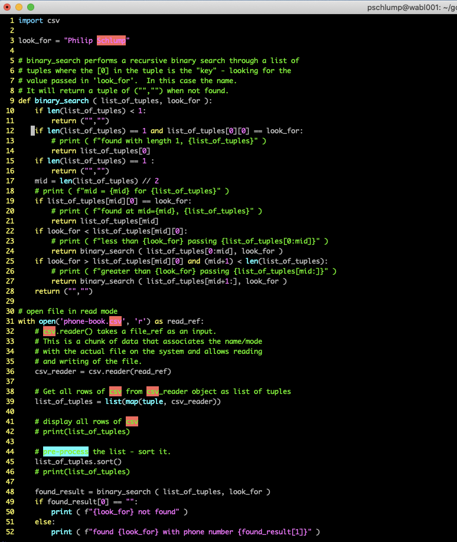

# Lecture 06 - More on lists

## Lists v.s. Tuples

```
l = [ 1, 2, 3 ]
l[1] = 8
print ( l )
```

So you can change a list.

Tuples are different - once a tuple is created you can't change it.

```
t = ( 1, 2, 3 )
t[0] = 8
```

Boom! error!

It is important to talk about *errors* with programs.

1. You are not going to break the computer by having an error.
2. Computers are not "fragile" - relative to software.
3. Don't pour a beer in your computer - that will break it.

Errors are *GOOD!*.

Let me repeat that!

Errors are *GOOD!*.

Let me explain that in detail.

First a quote from "Herohiso Honda" the founder and CEO of
Honda Motors.  "Success is a mater of finding the exceptions 
to errors.  If my managers are not making 10 errors a day
they are not doing enough."

Most of software development is getting to the *errors* .
You can't control how much good code you produce.  You can
control how fast you get to the errors.  You can learn to fix
the errors faster.   You can learn to code to prevent some
errors - but not many.   

If you want to program faster - then get to the errors faster.
Make more mistakes quicker.  

Now making mistakes is scary.  It is not what the educational
system tells you to do.  For some reason we teach people to
not make mistakes.  That is not how to develop software.
Make lots and lots of mistakes.  Keep a good list of the
mistakes.  Fix them one at a time. Automate the process
of keeping the errors out of your code.  Test lots.
Fix lots.  That is how you build software.

Now back to "tuples".


```
t = ( 1, 2, 3 )
```

So you can't change it.  You can get data out of it.

```
t = ( 1, 2, 3 )
print ( t[1] )
```

One error you can't have wit a tuple is to change the data.

So in the homework we are going to read in a file of names
with phone numbers.  Since the program only looks up a phone
number for a name - there is no reason to change the data.

That means to me that we want "immutable" data like a
tuple.  One mistake prevented.


### Important!  You will need the code below.

The code is in the file `read-csv.py`.
You will also want the file `phone-book.py` and 
`big-phone-book.csv`

```
import csv

# open file in read mode
with open('phone-book.csv', 'r') as read_ref:
    # csv.reader() takes a file_ref as an input.
	# This is a chunk of data that associates the name/mode
	# with the actual file on the system and allows reading
	# and writing of the file.
    csv_reader = csv.reader(read_ref)

    # Get all rows of csv from csv_reader object as list of tuples
    list_of_tuples = list(map(tuple, csv_reader))

    # display all rows of csv
    print(list_of_tuples)
```

You can pull out this set of code and run it.

It will print a list `[ ... ]` of tuples `( ... )`.

Why use a "file" and read it in?

Eventually we will be able to write a program and get 
it to work on multiple sets of data.  This program has
the file name, `phone-book.csv` in the code.  So this is
one step on the way to making files useful.

The real reason at this point is that we can test with
a small set of data, then switch the file to a big set of
data.


## Homework Part 2 - The Binary Search




