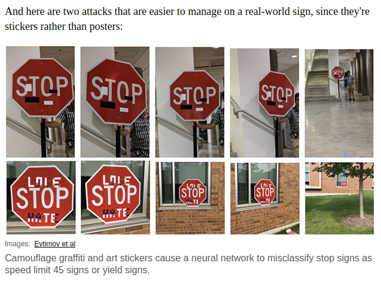
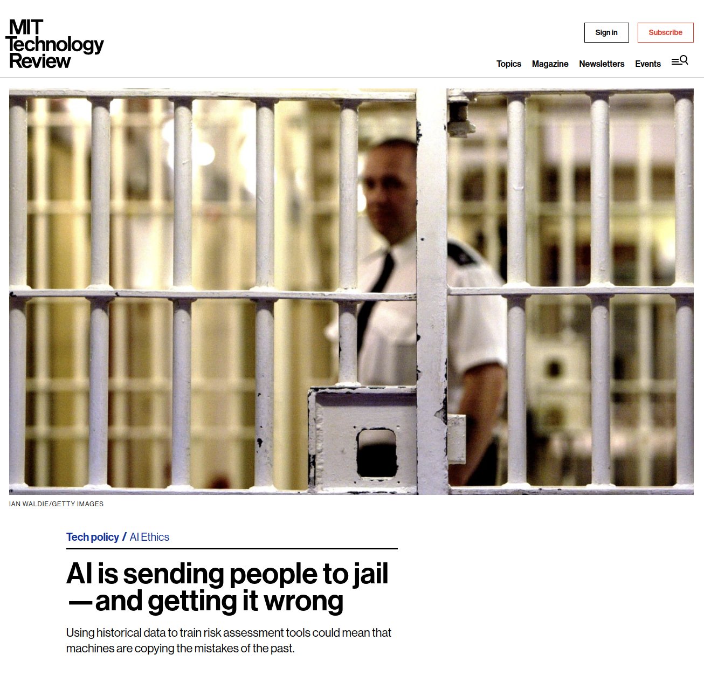

# Lecture 22 - Limits to Deep Neural Networks (DNN).

So...

DNNs or CNNs or machine learning in general can do some amazing things.

It can also mess it up at the amazing speed of a computer.

(From [https://spectrum.ieee.org/cars-that-think/transportation/sensors/slight-street-sign-modifications-can-fool-machine-learning-algorithms](https://spectrum.ieee.org/cars-that-think/transportation/sensors/slight-street-sign-modifications-can-fool-machine-learning-algorithms))

In the case above the stop sign is recognized as a 45 mile per hour sign.

Why?

How?

First what is getting it "right".   This is where you have to be very careful.   2 pictures of the
night sky:

On le left is what your perception tells you the night looks like.  If you take a picture with
an iPhone and its auto-color-correct neural network this is what you will get.

Most people think that it is 'correct'.

On the right is a picture taken by the person that has spent 15 billion dollars making
cameras for things like exploring mars, new horizons mission to Pluto and it is the
actual color of the night sky.   The one on the left is an *un-corrected* picture.
The green sky is because our atmosphere is 21% oxygen and it fluoresces in the
green range.

Which one is correct?

The problem with a CNN or a DNN is that they are only as good as the data.

One of the big things in new Apple hardware is automatic image processing using the
hardware neural processor.  On 10th of month the announcement of Apples M1 processor
had this in it:

[Screen-Shot-2020-11-10-at-13.07.41-PM.png](Screen-Shot-2020-11-10-at-13.07.41-PM.png)

Notice the Neural Processor right in the hardware of the machine.

AI systems entire world is the training data that it is trained on.

For self driving cars let me give you an example that explains just how hard
this is.

Also the "conditions" that things are bound by are what you tell the software.

Most humans are trained on real world with facts and limits.  Then have built
in expectations.   A creatures legs can not be 10 times the size of the creature.
If you drop something it falls (that is the "theory" of gravity).

How important are these expectations?  
