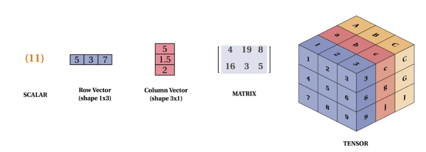
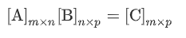
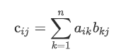
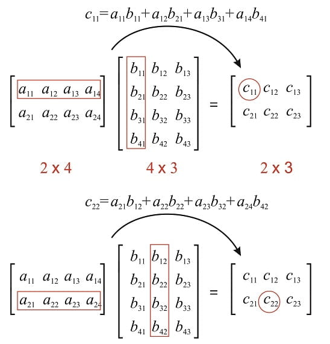
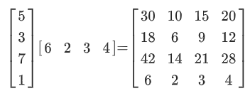
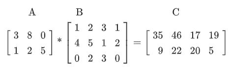

<style>
.pagebreak { page-break-before: always; }
.half { height: 200px; }
</style>

# Lecture 16 - tensor flow - math 

What is A "tensor" and how will it "flow"?

In the general definition "tensors" are arrays of numbers organized into an n-dimensional grid.

A scalar is a 1-ish number.  This is the simplest kind of tensor:


```

import tensorflow as tf

x = tf.constant(-2.0, name="x", dtype=tf.float32)
a = tf.constant(5.0, name="a", dtype=tf.float32)
b = tf.constant(13.0, name="b", dtype=tf.float32)

y = tf.Variable(tf.add(tf.multiply(a, x), b))

print ( "result is:" )
tf.print ( y )


```

Elements are positionaly identifiable.  So A at i,j,k is `Ai,j,k`.

A vector is a 1x array of numbers.  `[1,2,4]`  that is the x,y,z distance from the origin.

The tensor is the 3d vector of each of these.

You are not limited to 3d data.


So...

Tensor:




Ranking:

0 - scalar

1 - vector [1,2,3]

2 - matrix [ [1,2] , [2, 3] ]

3 - 3 tensor

4 - 4 tensor

Add of 2 matrix tensors

add1.py:

```
import tensorflow as tf

# let's create a ones 3x3 rank 2 tensor
rank_2_tensor_A = tf.ones([3, 3], name='MatrixA')
print("3x3 Rank 2 Tensor A: \n{}\n".format(rank_2_tensor_A))

# let's manually create a 3x3 rank two tensor and specify the data type as float
rank_2_tensor_B = tf.constant([[1, 2, 3], [4, 5, 6], [7, 8, 9]], name='MatrixB', dtype=tf.float32)
print("3x3 Rank 2 Tensor B: \n{}\n".format(rank_2_tensor_B))

# addition of the two tensors
rank_2_tensor_C = tf.add(rank_2_tensor_A, rank_2_tensor_B, name='MatrixC')
print("Rank 2 Tensor C with shape={} and elements: \n{}".format(rank_2_tensor_C.shape, rank_2_tensor_C))

```


Some matrix multiplication: 

Definition of multiply




Let's multiply using TF:

matmul1.py:
```

import tensorflow as tf

# Matrix A and B with shapes (2, 3) and (3, 4)
mmv_matrix_A = tf.ones([2, 3], name="matrix_A")
mmv_matrix_B = tf.constant([[1, 2, 3, 4], [1, 2, 3, 4], [1, 2, 3, 4]], \
    name="matrix_B", dtype=tf.float32)

# Matrix Multiplication: C = AB with C shape (2, 4)
matrix_multiply_C = tf.matmul(mmv_matrix_A, mmv_matrix_B, \
    name="matrix_multiply_C")

print("""Matrix A: shape {0} \nelements: \n{1} \n\n
Matrix B: shape {2} \nelements: \n{3}\n
Matrix C: shape {4} \nelements: \n{5}""". \
    format(mmv_matrix_A.shape, mmv_matrix_A, mmv_matrix_B.shape, \
    mmv_matrix_B, matrix_multiply_C.shape, matrix_multiply_C))
```

output:

```
Matrix A: shape (2, 3)
elements:
[[1. 1. 1.]
 [1. 1. 1.]]


Matrix B: shape (3, 4)
elements:
[[1. 2. 3. 4.]
 [1. 2. 3. 4.]
 [1. 2. 3. 4.]]

Matrix C: shape (2, 4)
elements:
[[ 3.  6.  9. 12.]
 [ 3.  6.  9. 12.]]
```

Inner Dimentions must be the same.

A by hand example:



With Some Data

First a 1x example:



Now an example for a homework.



## Matrices are useful


Calculate Inverse of the Matrix in the Example:

```
iim_matrix_A = tf.constant([[2, 3], [2, 2]], name='MatrixA', dtype=tf.float32)

try:
    # Tensorflow function to take the inverse
    inverse_matrix_A = tf.linalg.inv(iim_matrix_A)

    # Creating a identity matrix using tf.eye
    identity_matrix = tf.eye(2, 2, dtype=tf.float32, name="identity")

    iim_RHS = identity_matrix
    iim_LHS = tf.matmul(inverse_matrix_A, iim_matrix_A, name="LHS")

    predictor = tf.reduce_all(tf.equal(iim_RHS, iim_LHS))
    def true_print(): print("""A^-1 times A equals the Identity Matrix
Matrix A: \n{0} \n\nInverse of Matrix A: \n{1} \n\nRHS: I: \n{2} \n\nLHS: A^(-1) A: \n{3}""".format(iim_matrix_A, inverse_matrix_A, iim_RHS, iim_LHS))
    def false_print(): print("Condition Failed")
    tf.cond(predictor, true_print, false_print)

except:
    print("""A^-1 doesnt exist
    Matrix A: \n{} \n\nInverse of Matrix A: \n{} \n\nRHS: I: \n{}
    \nLHS: (A^(-1) A): \n{}""".format(iim_matrix_A, inverse_matrix_A, iim_RHS, iim_LHS))
```


