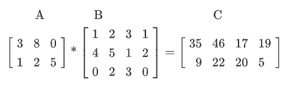

m4_changequote(`[[[',`]]]')

<style>
.pagebreak { page-break-before: always; }
.half { height: 200px; }
</style>

# Lecture 16 - tensor flow - math 

What is A "tensor" and how will it "flow"?

In the general definition "tensors" are arrays of numbers organized into an n-dimensional grid.

A scalar is a 1-ish number.  This is the simplest kind of tensor:


```
m4_import(tf1.py)
```

Elements are positionaly identifiable.  So A at i,j,k is `Ai,j,k`.

A vector is a 1x array of numbers.  `[1,2,4]`  that is the x,y,z distance from the origin.

The tensor is the 3d vector of each of these.

You are not limited to 3d data.


So...

Tensor:


Ranking:

0 - scalar

1 - vector [1,2,3]

2 - matrix [ [1,2] , [2, 3] ]

3 - 3 tensor

4 - 4 tensor

Add of 2 matrix tensors

add1.py:

```
m4_import(add1.py)
```


Some matrix multiplication: 

Definition of multiply


Let's multiply using TF:

matmul1.py:
```
m4_import(matmul1.py)
```

output matmul1.out:

```
m4_import(matmul1.out)
```

Inner Dimentions must be the same.

A by hand example:


With Some Data

First a 1x example:


Now an example for a homework.



## Matrices are useful


Calculate Inverse of the Matrix in the Example:

inv.py:

```
m4_import(inv.py)
```

And the output:

```
m4_import(inv.out)
```


