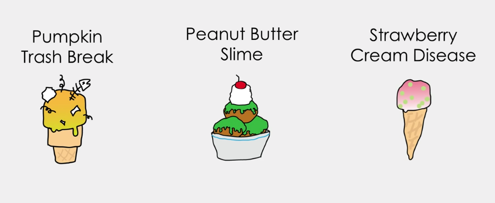
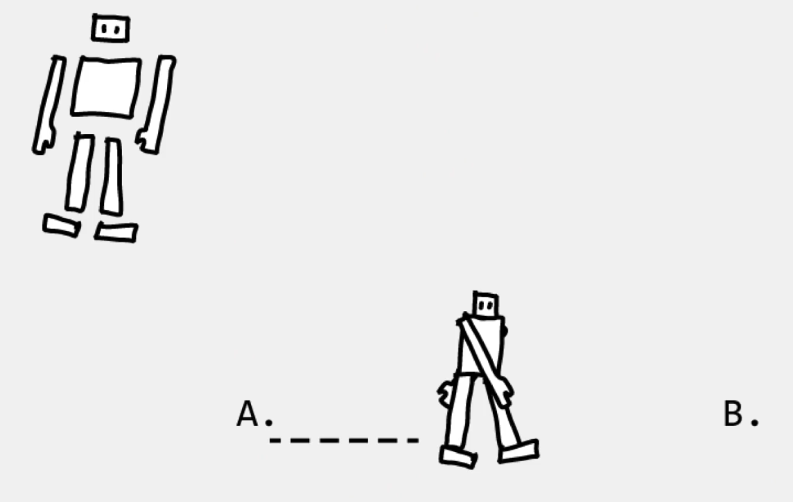
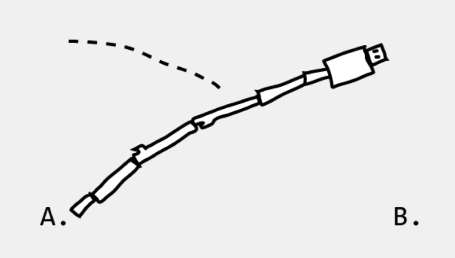

# Lecture 26 - What goes wrong..., "artificial stupidity"

1/2 of this lecture is from,  "You Look Like a Thing and I Love You" by
Janelle Shane an AI Researcher, Janelle Shane.

What do we see in AI's in the "movies" or with SciFi stories.   In the
Terminator the AI "decides" that it is malicious and destroys humanity.
AI is more of the intelligence level of an earth worm and it has no
"malicious" intent.   What is has garbage-in garbage-out world.

Image recognition in self driving cars is a really good example.
Tesla "auto pilot" was designed in version 1 to drive on highways.
So somebody turned on the auto pilot and used it on a city street.
A truck pulled out sideways in front of the Tesla and the Tesla
drove right into the truck.

So it's concept of a "truck" one the front or back of a truck,
or a truck passing on either side.   When a truck was not moving
in front of it - it "recognized" the big-square object as an
overhead road sign - and chose to drive "under" it.  OOps.

Some years ago I was driving in New York wen a fairly large
rock breaks off of a clif and comes rolling across the road.
The rock was perhaps 5 or 10 tons.   I stomped on the breaks
and managed to avoid the rock.    The question for these self
driving systems is how many large rocks in traffic are they
trained on?

Another thing to ponder is the concept that the computer is
always right.   Basically this is the fact that if you are
filling out a form and the form has an entry field in it
for a first name, middle initial, and a last name - what happens if you don't
have one?  Lot's of folks don't have a middle name at all - or they have 2.
Or what about my friend that his last name is just the letter, 'G'.
Will the form allow single letter last names?  What about hyphenated
last names (fairly common now).   I know of a family that the last
name is Homer-Wambiem.    The modern reality is that it is not
important what gets specified in the laws, what is real is what
the computer programmers enter into the form or user interface.

The same applies to AI.   One of the famous examples of failing to
take into consideration different possibilities is an early self
driving example from Google - now Waymo.  One of the blind employees
was using a self driving car to get to work.  He was hungry so
he told the card to go through the drive through on a restaurant.
His intent was to order some food.  The car obediently slowed,
turned into the drive through, drove through it without stopping
and got back on the street.

Some of this is a "communication" problem - what do you mean by
"go through the drive through".  Some of it is an AI training
problem - like the AI has to be trained to "stop" at the order
and pickup windows.  Some of it is a "concept" problem.  The AI only knows what it
is trained to do.  What it reveils is that the AI has no "malicios" intent - it is
just trained to do what it is trained to do.

## Making Flavors

Take 1600 real flavors - train an AI to produce better new flavors.

## Walker goes wacky

You can train a NN to walk!

<!--
	3:30 to 3:59
-->

A few principals:

1. A.I. takes the path of least resistance.
2. A.I. will not understand the problem you are trying to solve.
3. The danger of AI is not that it's too smart but it's not smart enough.
4. Limited data in = bazaar/weird results out.
5. A.I. will not "steel" your job - it will transform it into a different world.

## Police and Racism

[https://www.technologyreview.com/2020/07/17/1005396/predictive-policing-algorithms-racist-dismantled-machine-learning-bias-criminal-justice/](https://www.technologyreview.com/2020/07/17/1005396/predictive-policing-algorithms-racist-dismantled-machine-learning-bias-criminal-justice/)

## The "Algorithm"

[https://www.nytimes.com/2019/08/11/world/americas/youtube-brazil.html](https://www.nytimes.com/2019/08/11/world/americas/youtube-brazil.html)

